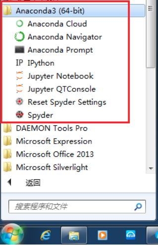
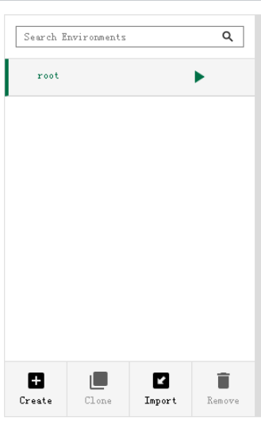
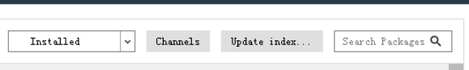

## Demo

<p>
This is a demo to make a software with different image processing methods. 
If you want to run this demo, please run main.py file with python. 
If you have any questions, please contect with zhou (zhou.shi403@mail.kyutech.jp).
</p>  

## Requirement
```shell
A.python3
B.PyQt5
C.OpenCV
```
## install
1 . windows
```shell
1.please download the .exe file from https://www.anaconda.com/products/individual, and then install it
2.click anaconda Navigator, anaconda will be opened
``` 
<p align="center">
  
</p>

```shell
3.first click environments, then click create, a new environment will be created
```
<p align="center">
  
</p>

```shell
4.change installed into all, then search opencv and pyqt to install the two package
```
<p align="center">
  
</p>

2 . ubuntu

```shell
1.please download the .sh file from https://www.anaconda.com/products/individual
2.Open the terminal in the directory where the .sh file is located 
3.run: sh filename.sh # filename denote the file name of the .sh
4.run: conda create -n Y_K_C
5.run: conda activate Y_K_C
6.run: conda install opencv
7.run: conda install pyqt
``` 
3 . note
<p>
if you want to learn more about pyqt, please install anaconda + pyqt5 + eric6, It will be helpful.
</p>